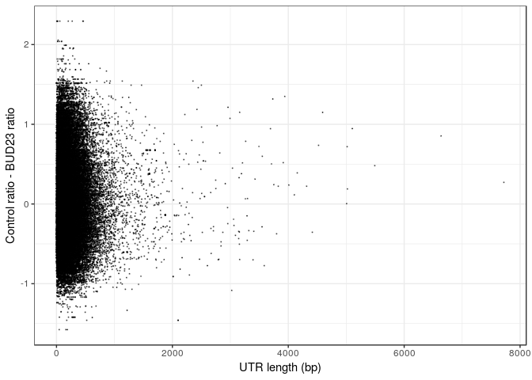
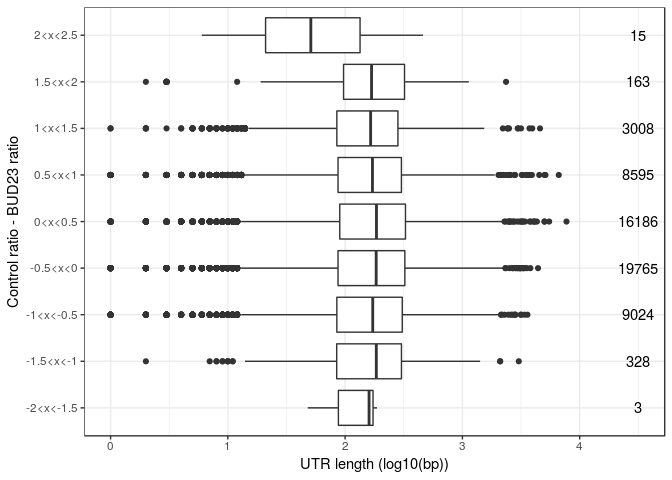
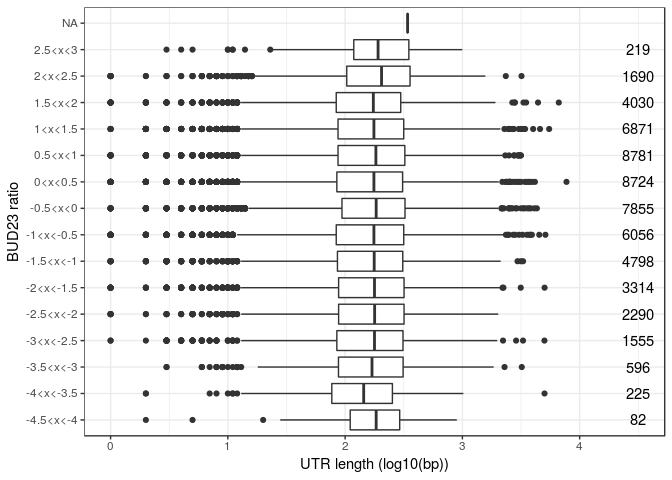
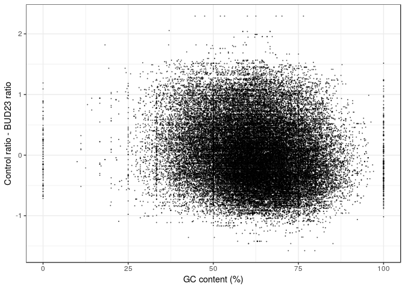
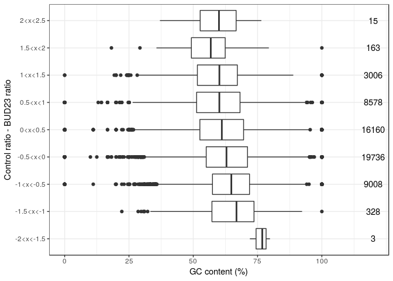

-   [Translational Efficiency Analysis](#translational-efficiency-analysis)

Translational Efficiency Analysis
=================================

    ## 
    ##  Pearson's product-moment correlation
    ## 
    ## data:  temp_dat$RAT and temp_dat$TOT_LENGTH
    ## t = -0.40332, df = 56995, p-value = 0.6867
    ## alternative hypothesis: true correlation is not equal to 0
    ## 95 percent confidence interval:
    ##  -0.009898881  0.006520339
    ## sample estimates:
    ##          cor 
    ## -0.001689385

    ## Warning in cor.test.default(x = temp_dat$RAT, y = temp_dat$TOT_LENGTH,
    ## method = "spearman"): Cannot compute exact p-value with ties

    ## 
    ##  Spearman's rank correlation rho
    ## 
    ## data:  temp_dat$RAT and temp_dat$TOT_LENGTH
    ## S = 3.092e+13, p-value = 0.6435
    ## alternative hypothesis: true rho is not equal to 0
    ## sample estimates:
    ##          rho 
    ## -0.001938717

    ## 
    ##  Pearson's product-moment correlation
    ## 
    ## data:  temp_dat$RAT and temp_dat$ave_GC
    ## t = -32.209, df = 56995, p-value < 2.2e-16
    ## alternative hypothesis: true correlation is not equal to 0
    ## 95 percent confidence interval:
    ##  -0.1417590 -0.1256333
    ## sample estimates:
    ##       cor 
    ## -0.133705

    ## Warning in cor.test.default(x = temp_dat$RAT, y = temp_dat$ave_GC, method =
    ## "spearman"): Cannot compute exact p-value with ties

    ## 
    ##  Spearman's rank correlation rho
    ## 
    ## data:  temp_dat$RAT and temp_dat$ave_GC
    ## S = 3.5114e+13, p-value < 2.2e-16
    ## alternative hypothesis: true rho is not equal to 0
    ## sample estimates:
    ##       rho 
    ## -0.137834
