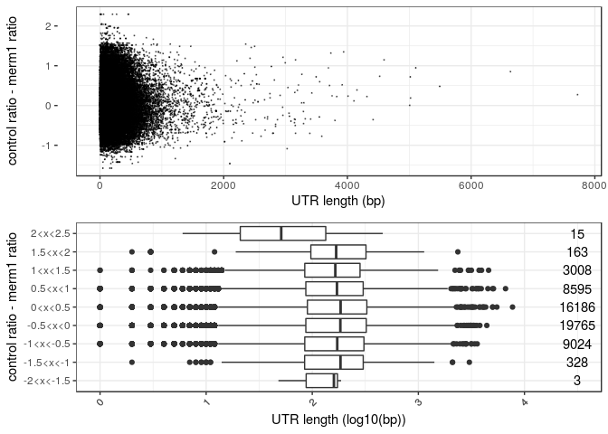
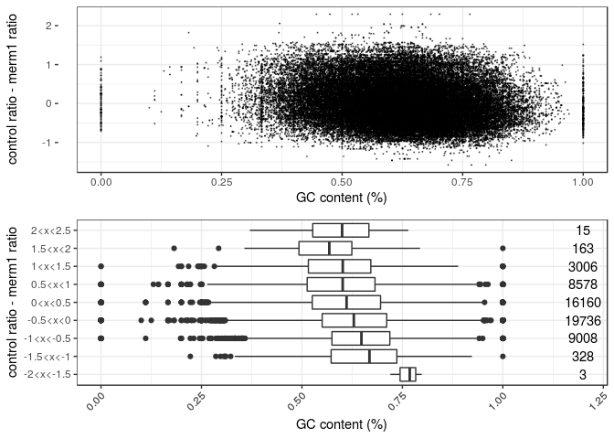

    ##    TRANS      ratio LENGTH  GC_count
    ## 1 100000 -0.6443941    117 0.5862069
    ## 2 100000 -0.6443941     92 0.5384615
    ## 3 100001 -0.6443941    248 0.5789474
    ## 4 100001 -0.6443941     87 0.5465116
    ## 5 100002 -0.6443941    122 0.5867769
    ## 6 100002 -0.6443941     69 0.6029412

